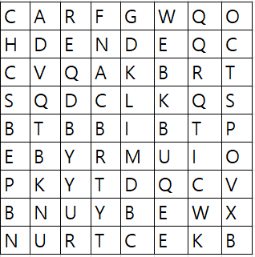

## 문제) 8X8로 이루어진 빙고가 존재합니다.



* 1) 빙고를 array_Image1과 같도록 우로 1회 회전시키시오.


*  2) 원본의 빙고에서 아래 단어들을 찾아내시오.
      단어는 왼쪽-> 오른쪽, 오른쪽->왼쪽 , 위 -> 아래 , 아래 -> 위 , 대각선 방향으로 존재합니다. 
      [MILK , CAR , WEB , RUN , STUDY]
    
      출력할 답 : 찾은 단어 리스트는 : 1.CAR 2.MILK 3.RUN 4.STUDY 5.WEB 입니다. 
      
      


## 답안

```java
public class arrayExample {
   
    static char[][] bingo;

/*
 *  문제) 8X8로 이루어진 빙고가 존재합니다.
 * 
 * 
 *  1-1) 빙고를 array_Image1과 같도록 우로 1회 회전시키시오.
 *  
 *  
 *  
 *  
 *  1-2) 원본의 빙고에서 아래 단어들을 찾아내시오.
 *    단어는 왼쪽-> 오른쪽, 오른쪽->왼쪽 , 위 -> 아래 , 아래 -> 위 , 대각선 방향으로 존재합니다. 
 *    [MILK , CAR , WEB , RUN , STUDY]
 *    
 *    출력할 답 : 찾은 단어 리스트는 : 1.CAR 2.MILK 3.RUN 4.STUDY 5.WEB 입니다. 
 *    
 * 
 * 
 */
    
    
   //실행
   public static void main( String[] args ) {
      
      bingo = makeBingo();
      
      RotationBingo(bingo);
      FindEngWord(bingo);
      
   }
   
   
   // 8X8 빙고 만들기
   static char[][] makeBingo(){
      
      System.out.println( "****************** 8 X 8 ******************" );
      
      char[][] tempArray = {
            {'C','A','R','F','G','W','Q','O',},
            {'H','D','E','N','D','E','Q','C'},
            {'C','V','Q','A','K','B','R','T'},
            {'S','Q','D','C','L','K','Q','S'},
            {'B','T','b','b','I','b','T','P'},
            {'E','B','Y','R','M','U','I','O'},
            {'P','K','Y','T','D','Q','C','V'},
            {'B','N','U','Y','B','E','W','X'},
            {'N','U','R','T','C','E','K','B'},};
      
      
      for(int i = 0 ; i < tempArray.length; i++){
         for(int z = 0 ; z<tempArray[i].length; z++){
            System.out.print( "[" + tempArray[i][z] +"]" );
         }
         System.out.println();
      }
      
      System.out.println( "******************************************" );
      
      return tempArray;
   }
      
   
   static void RotationBingo(char[][] Ary){
      
      /***
       *  정답란 
       */
      
   }
   
   
   static void FindEngWord(char[][] Ary){
      
      /***
       *  정답란 
       */
      
   }

}
```
